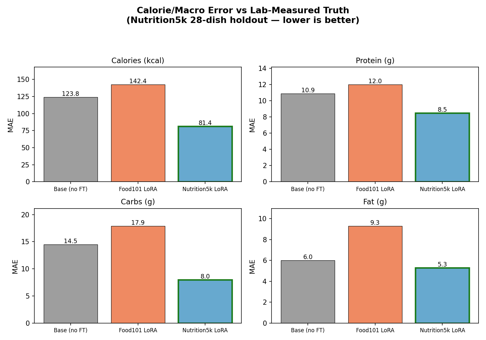

# Nutrition Coach — Calorie-Counter VLM

Fine-tuning **Qwen3-VL-4B-Instruct** to estimate calories and macros from a food
photo, returning structured JSON.

The core experiment compares two fine-tuning datasets to show how label quality
drives results:

| Dataset | Labels | Outcome |
|---------|--------|---------|
| **Food101** | Class name → *synthetic* USDA class-average nutrition | Hurts accuracy — model collapses dishes into 101 buckets |
| **Nutrition5k** | *Real lab-measured* calories/macros per dish | Best estimator; wins on every nutrient |

## Result (clean 28-dish Nutrition5k holdout, mean absolute error)

| Nutrient | Base (no FT) | Food101 LoRA | **Nutrition5k LoRA** |
|----------|-------------|--------------|----------------------|
| Calories | 123.8 kcal | 142.4 kcal | **81.4 kcal** |
| Protein  | 10.9 g | 12.0 g | **8.5 g** |
| Carbs    | 14.5 g | 17.9 g | **8.0 g** |
| Fat      | 6.0 g | 9.3 g | **5.3 g** |



Nutrition5k wins across the board. Notably **Food101 fine-tuning is worse than
no fine-tuning** — training on fabricated class-average labels teaches confident
wrong mappings (e.g. it predicted "grilled salmon" for 8 unrelated dishes
spanning 21–1116 kcal). Real measured data is what produces genuine estimation.

Regenerate the chart with `python -m src.plot_results`.

## Model output format

```json
{
  "food_name": "dish",
  "serving_description": "371g serving",
  "calories": 430.0,
  "protein_g": 30.0,
  "carbs_g": 40.0,
  "fat_g": 20.0
}
```

## Project layout

```
src/
  config.py          model id, prompt, paths, LoRA config, Food101 nutrition map
  data.py            triplet builders + chat dataset + masking collator
  train.py           QLoRA fine-tuning (CUDA / Kaggle T4)
  evaluate.py        3-way comparison on the Nutrition5k holdout
  infer.py           single-image inference (base or adapter)
  extract_adapter.py salvage a clean adapter from a full model save
  download_holdout.py fetch clean holdout dishes via gsutil
  plot_results.py    render the MAE comparison chart
assets/              mae_comparison.png
requirements.txt
```

`data/` and `adapters/` are git-ignored (large). See below to reproduce.

## Setup

```bash
python -m venv .venv && source .venv/bin/activate
pip install -r requirements.txt
```

## Inference

```bash
# base model
python -m src.infer path/to/food.jpg

# with a fine-tuned adapter
python -m src.infer path/to/food.jpg --adapter adapters/nutrition5k-lora-adapter
```

Inference runs on Apple Silicon (MPS), CUDA, or CPU. The adapter loads on top of
the bf16 base — no bitsandbytes/CUDA required.

## Training (CUDA GPU, e.g. Kaggle T4)

```bash
python -m src.train --dataset nutrition5k --out adapters/nutrition5k-lora-adapter
python -m src.train --dataset food101     --out adapters/food101-lora-adapter
```

`train.py` saves a clean ~33 MB LoRA adapter (not the full quantized model). T4
specifics — fp16 compute, AMP disabled to avoid a bf16 GradScaler crash — are
documented in the module docstring.

> If you ever end up with a full `model.safetensors` save instead of an adapter,
> recover it: `python -m src.extract_adapter <full_save_dir> <out_adapter_dir>`

## Data

- **Food101** — HuggingFace dataset, saved to `data/food101` via
  `datasets.load_dataset("food101")`. Has no nutrition labels; class→nutrition
  averages live in `src/config.py`.
- **Nutrition5k** — Google's measured-nutrition dataset
  ([GCS bucket](https://console.cloud.google.com/storage/browser/nutrition5k_dataset)).
  Only the overhead RGB image per dish + metadata CSVs are needed. Pull a clean
  holdout with `python -m src.download_holdout --n 15` (needs `gsutil`).

## Evaluation

```bash
python -m src.evaluate          # all holdout dishes
python -m src.evaluate --n 8    # quick subset
```

Loads the base model once, hot-swaps both adapters, and prints per-dish
calories plus per-nutrient MAE.
